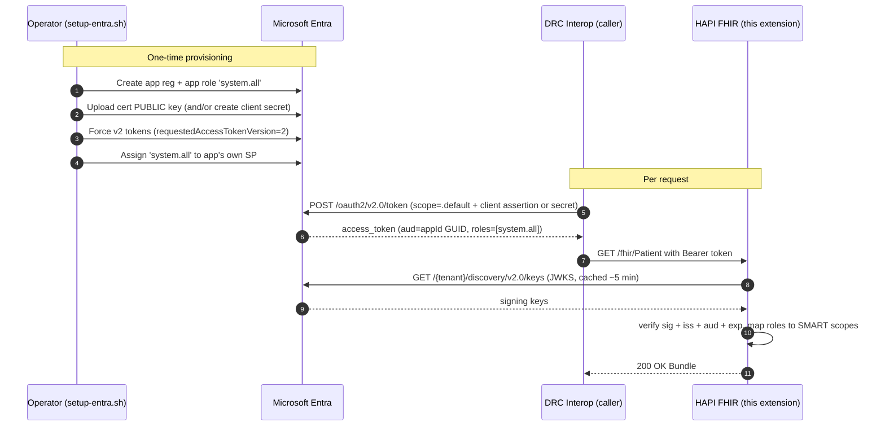

# HAPI FHIR Multi-Issuer Auth Extension

Spring Boot add-on for the [`hapiproject/hapi`](https://hub.docker.com/r/hapiproject/hapi)
JPA starter image that adds:

- **Multi-issuer JWT validation** — Microsoft Entra (Azure AD) **and** SMART on FHIR backend services in the same server.
- **Per-issuer JWKS caching** with OIDC discovery or an explicit `jwks-uri`.
- **Signature + issuer + audience + expiry** validation.
- **Claim normalization** across Entra (`scp`/`roles`, `azp`/`appid`) and SMART (`scope`, `sub`/`iss`).
- **Scope-based HAPI `AuthorizationInterceptor`** that enforces `system/<resource>.read` and `system/<resource>.write` (and `*` wildcards) per request.
- **Opt-in**: the extension is a no-op unless `hapi.auth.enabled=true`.

All requests are treated as **M2M** — no user context, no patient compartment, system-level only. Callers authenticate with **either** a client certificate (`private_key_jwt`) **or** a client secret — both flavours of OAuth 2.0 `client_credentials` are supported.

## Module layout

```
src/hapi-auth/
├── Dockerfile                  Multi-stage build → image with the JAR layered in
├── pom.xml
└── src/main/
    ├── java/com/microsoft/hlspso/hapiauth/
    │   ├── HapiAuthAutoConfiguration.java    Boot auto-config entry point
    │   ├── config/AuthProperties.java        @ConfigurationProperties("hapi.auth")
    │   ├── jwt/
    │   │   ├── MultiIssuerJwtDecoder.java    Per-issuer NimbusJwtDecoder dispatch
    │   │   ├── AudienceValidator.java        aud claim check
    │   │   ├── AuthenticatedPrincipal.java   Normalized principal stored on Authentication
    │   │   └── PrincipalAuthenticationConverter.java  JWT → Spring Authentication
    │   ├── security/SecurityConfig.java      Spring Security filter chain
    │   └── interceptor/ScopeAuthorizationInterceptor.java  HAPI rule builder per request
    └── resources/
        ├── META-INF/spring/org.springframework.boot.autoconfigure.AutoConfiguration.imports
        └── application-auth-example.yml
```

## Configuration

All properties live under `hapi.auth` and can be supplied through `application.yaml` or environment variables (Spring Boot relaxed binding, e.g. `HAPI_AUTH_ENABLED`).

| Key | Description |
|---|---|
| `hapi.auth.enabled` | Master switch. Defaults to `false`. |
| `hapi.auth.allow-anonymous-metadata` | When `true`, `/fhir/metadata`, `/.well-known/**` and Swagger UI stay open. Default `true`. |
| `hapi.auth.issuers[i].id` | Friendly id used in logs. |
| `hapi.auth.issuers[i].issuer-uri` | Required. Must equal the `iss` claim. |
| `hapi.auth.issuers[i].jwks-uri` | Optional. Falls back to OIDC discovery from `issuer-uri`. |
| `hapi.auth.issuers[i].audiences[]` | Required. Token `aud` must match one. |
| `hapi.auth.issuers[i].flavor` | `ENTRA` or `SMART` — controls claim normalization. |
| `hapi.auth.issuers[i].tenant` | Optional partition/tenant marker for multi-tenant routing. |

See [application-auth-example.yml](src/main/resources/application-auth-example.yml).

### Example — one Entra tenant + one SMART issuer

```yaml
hapi:
  auth:
    enabled: true
    issuers:
      - id: entra-contoso
        issuer-uri: https://login.microsoftonline.com/00000000-0000-0000-0000-000000000000/v2.0
        audiences: [api://hapi-fhir]
        flavor: ENTRA
      - id: smart-customerA
        issuer-uri: https://auth.customerA.example/fhir
        jwks-uri:  https://auth.customerA.example/fhir/.well-known/jwks.json
        audiences: [https://hapi-fhir.example/fhir]
        flavor: SMART
        tenant: customerA
```

## How scopes are enforced

`ScopeAuthorizationInterceptor` builds a HAPI rule list per request:

| Operation | Required scope |
|---|---|
| `read`, `vread`, `search-type`, `search-system`, `history-*`, `get-page` | `system/<Resource>.read` (or `system/*.read`) |
| `create`, `update`, `patch`, `delete`, `transaction`, `batch` | `system/<Resource>.write` (or `system/*.write`) |
| `metadata` | always allowed |
| system-level (no resource) | requires `system/*.read` or `system/*.write` |

A `write` scope implicitly grants read for the same resource.

### `_include` / `_revinclude` and the rule list

HAPI's `AuthorizationInterceptor` evaluates **every** resource that ends up in
the response bundle, not just the resource type in the request URL. A query
like

```
GET /Appointment?practitioner=8150&_include=Appointment:patient&_include=Appointment:practitioner
```

returns `Appointment` **plus** the referenced `Patient` and `Practitioner`
resources. If the rule list only allows reading `Appointment`, HAPI rejects
the whole response with:

```json
{"resourceType":"OperationOutcome","issue":[{"severity":"error","code":"processing",
 "diagnostics":"HAPI-0334: Access denied by default policy (no applicable rules)"}]}
```

— even though the search itself succeeded. (Confusingly, the same query
returns `200 OK` when the result set is empty, because there are no included
resources to authorize.)

`ScopeAuthorizationInterceptor` handles this in two ways:

1. **`system/*.read` / `system/*.*` fast-path** — returns `allowAll`, so all
   includes pass automatically. This is what the default Entra `system.all`
   app role maps to.
2. **Typed scopes** — when the token only carries
   `system/<Resource>.read` scopes (no wildcard), the interceptor builds a
   `read` rule for the primary resource **and** for every other resource type
   the token grants `.read` on. Callers that need `_include` for Patient and
   Practitioner must therefore be granted `system/Patient.read` and
   `system/Practitioner.read` in addition to `system/Appointment.read`.

## Build & run via Docker

The docker-compose service `hapi-fhir` builds this directory in a multi-stage Dockerfile:

```bash
cd src/docker
docker compose build hapi-fhir
docker compose up -d hapi-fhir
```

To turn auth **on**, edit `docker-compose.yml` (or pass `-e`) so the `hapi-fhir` service has, e.g.:

```yaml
environment:
  HAPI_AUTH_ENABLED: "true"
  HAPI_AUTH_ISSUERS_0_ID: entra-contoso
  HAPI_AUTH_ISSUERS_0_ISSUERURI: https://login.microsoftonline.com/<tenantId>/v2.0
  HAPI_AUTH_ISSUERS_0_AUDIENCES_0: api://hapi-fhir
  HAPI_AUTH_ISSUERS_0_FLAVOR: ENTRA
```

With `HAPI_AUTH_ENABLED=false` (default) the extension is dormant — useful for local demos.

## Setting up Microsoft Entra (machine-to-machine)

The `scripts/setup-entra.sh` / `setup-entra.ps1` helpers provision a **single
app registration** that plays both roles (resource API *and* client). For
production you may want two separate app regs, but a single one keeps the
local/dev setup minimal.

### Trust & credential flow



### Who holds which key

| Component | Holds | Purpose |
|---|---|---|
| **Entra app reg** | Cert **public** half **and/or** client secret hash | Verifies the caller's identity when minting tokens |
| **DRC interop caller** | Cert **private** key + cert **or** client secret | Signs the client assertion (or sends the secret) to obtain a token |
| **HAPI** (this extension) | Nothing caller-specific — only the issuer URI + audience | Validates tokens against Entra's JWKS endpoint. Never sees the caller's key/secret. |

So a **public-key handover to HAPI is not needed**. To onboard a partner you give them only:

- `tenantId`
- `clientId` (the app's `appId`)
- **either** the certificate + private key **or** the client secret

### One-shot setup

```bash
cd src/hapi-auth/scripts
./setup-entra.sh        # or: pwsh ./setup-entra.ps1
```

The script will:

1. Generate a self-signed cert + RSA key under `src/hapi-auth/certs/` (gitignored).
2. Create the app registration `hls-pso-hapi-fhir` (idempotent).
3. Set the Application ID URI to `api://{appId}`.
4. Force v2 tokens (`api.requestedAccessTokenVersion = 2`).
5. Define the `system.all` app role.
6. Upload the cert; create the SP; self-assign the role.
7. Upsert `ENTRA_*` keys into `src/docker/.env` (consumed by `docker-compose.yml`).
8. Write `src/bruno-hapi/.env` (gitignored) for Bruno end-to-end tests.

### Important quirks (validated against a real tenant)

- **Audience is the bare `appId` GUID, not `api://{appId}`.** Entra v2 tokens issued for the `api://{appId}/.default` scope put the GUID alone in `aud`. The setup scripts write `ENTRA_AUDIENCE=${APP_ID}` accordingly.
- **`.default` is a request-side scope only** — never appears in the issued token. Actual permissions arrive in `roles` (app roles) or `scp` (delegated).
- **App role values cannot contain `/`**, so we register `system.all` (dot notation) and map it to `system/*.*` in `PrincipalAuthenticationConverter.mapEntraRoleToScope()`. Same translation applies to `<Resource>.read|write` → `system/<Resource>.<op>`.
- **Subscription-less tenants**: `setup-entra.*` uses `az login --allow-no-subscriptions`.

### Cert vs. client secret

`setup-entra.{sh,ps1}` provisions **both** credentials so partners can pick whichever fits their toolchain:

| Credential | Stored in `bruno-hapi/.env` as | Token request flavour |
|---|---|---|
| Self-signed cert (default, recommended) | `ENTRA_PRIVATE_KEY_PEM` + `ENTRA_CERT_THUMBPRINT_HEX` | `private_key_jwt` (signed JWT assertion) |
| Client secret | `ENTRA_CLIENT_SECRET` | `client_secret` (shared secret in form body) |

From HAPI's side both look identical — same `aud`, same `roles` claim, same scope mapping. Pick the one that matches the caller's environment.

### Testing both paths with Bruno

The `src/bruno-hapi` collection ships two pre-wired environments:

- **`entra`** — cert-based `private_key_jwt` (uses `ENTRA_PRIVATE_KEY_PEM` + `ENTRA_CERT_THUMBPRINT_HEX`).
- **`entra-secret`** — plain `client_secret` (uses `ENTRA_CLIENT_SECRET`).

Both share the same pre-request script in `collection.bru`, which auto-selects the flavour based on which env vars are set, caches the access token until 30 s before expiry, and attaches it as `Authorization: Bearer ...` on every request. Switch the active environment in Bruno's top-right selector to flip between flavours.

## Setting up SMART on FHIR backend services

1. Register the client at the customer's SMART auth server with a JWKS URL exposing the client's public key (no shared secret).
2. Request `system/*.read` (and/or `.write`) scopes.
3. Configure this extension with that auth server's `issuer-uri` and `jwks-uri`, and `audiences = [<this HAPI server's FHIR base URL>]`.

## Notes

- `application-auth-example.yml` is **not** auto-loaded — copy values into the running container's environment or its own `application.yaml`.
- JWKS responses are cached by `NimbusJwtDecoder` (default ~5 min). Rotate keys on either issuer transparently.
- All requests run with system-level access — there is no patient compartment filtering. If you need that later, extend `ScopeAuthorizationInterceptor`.
